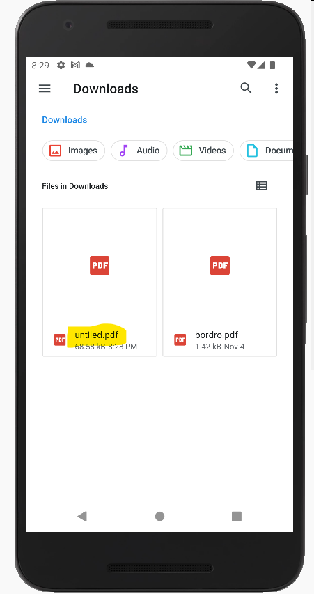

# Screen to pdf in flutter

Packages used:

pdf: ^3.8.4 : to create a pdf

screenshot: ^1.2.3 : to take a screenshot

pdfx: ^2.3.0 : to view pdf

share_plus: ^6.2.0 : for file sharing

permission_handler: ^10.2.0 : to request permission from the user while the application is running

path_provider: ^2.0.11 : A Flutter plugin for finding commonly used locations on the filesystem.

